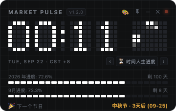
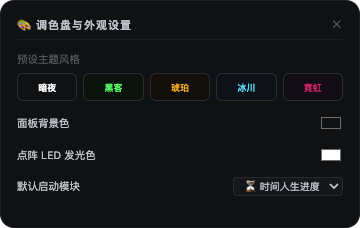

# ⏱️ Market Pulse Pixel Clock (桌面极客像素时钟)

<p align="center">
  
</p>

<p align="center">
  <b>一款专为 macOS 设计的极客复古赛博朋克桌面悬浮像素时钟小组件</b><br/>
  融合 5×7 LED 硬件点阵、毫秒级动态流体粒子矩阵、人生与节日倒计时、系统性能监控与多主题调色盘。
</p>

<p align="center">
  
  
  
  
</p>

---

## 🌟 核心特性

### 1. 5×7 经典点阵数字与翻页卷帘动效
- 精确还原老式 LED 硬件点阵显示屏质感，每个数字由 **5×7 像素阵列** 构成。
- 背景常驻暗灰高对比度未点亮像素格（`#24282e`），点亮数字具备柔和白色发光辉光。
- 分钟跳变时自动执行带时间梯度的**逐行像素卷帘翻页（Pixel Roll Transition）**。
- 冒号秒级节律跳动，具备独立点阵槽位。

### 2. 8×8 动态流体粒子波形矩阵
- 时钟右侧配备 8×8 粒子画布，根据实时毫秒时间生成连续的**对角能量波与随机流体光斑**。
- 为静态桌面时钟赋予生生不息的“时间流动感”。

### 3. 底部可插拔 6 大功能模块（按需随心切换）
点击中间导航的 **`‹`** / **`›`** 或模块名称，可瞬时切换底部面板：

| 模块名称 | 核心功能说明 |
| :--- | :--- |
| **⏳ 时间人生进度** | 全年已过百分比 + 像素进度条 + 剩余天数；当月进度；**自动侦测下一个传统/法定节日**（如中秋节、国庆节）倒计时。 |
| **⚡ 系统性能与硬件监控** | 实时读取 Mac 的 **CPU 占用率**（含核心数）、**RAM 内存使用量**（已用/总计 GB）与 **Macintosh HD 磁盘剩余容量**，三排动态像素条跳动。 |
| **🍅 番茄专注时钟** | **25 分钟工作 / 5 分钟休息**双模式循环，像素进度条实时推进，支持开始、暂停与重置。 |
| **🌍 世界主要时钟** | 免去股票信息打扰，纯粹展示 **北京 (UTC+8)**、**东京 (UTC+9)**、**伦敦 (UTC+1)** 实时当地时间。 |
| **📈 全球金融市场** | 实时追踪 **上交所 (SSE)**、**港交所 (HKEX)**、**纽交所 (NYSE)** 开闭市（OPEN / CLOSED）状态及各交易所当地时间。 |
| **⏱️ 极简纯钟模式** | 一键折叠隐藏底部所有模块，窗口智能收缩为 **136px** 极简高度条，纯粹沉浸大时钟。 |

---

## 🎨 调色盘与个性化外观

<p align="center">
  
</p>

点击右上角 **`🎨`** 打开半透明滑动设置面板：
- **5 款预设极客主题一键切换**：
  - **暗夜**：深邃纯黑底色 + 纯白 LED 发光
  - **黑客**：黑客帝国深绿 + 荧光绿点阵
  - **琥珀**：工业复古暖棕 + 琥珀橙光
  - **冰川**：深海午夜蓝 + 极冷冰青荧光
  - **霓虹**：赛博朋克深紫 + 荧光粉紫
- **自定义色盘**：支持自由拾取面板背景色与点阵发光色。
- **本地记忆**：所有配置保存在 `localStorage`，重启软件自动加载。

---

## 🖥️ 桌面交互设计

- **不占用 Dock 栏**：底层配置 macOS `LSUIElement: 1` 与 `app.dock.hide()`，成为纯净的桌面级小组件，不占用屏幕底部菜单栏。
- **全新矢量图钉置顶**：右上角 SVG 图钉，点击具备 **45° 倾斜 + 红色高亮发光** 明确视觉反馈，支持跨工作区全屏悬浮置顶。
- **无边框悬浮卡片**：1:1 紧密贴合窗口，彻底去除冗余透明边框与虚化外阴影。
- **自由拖拽**：鼠标按住卡片任意空白区域即可在桌面上自由移动。
- **低饱和度哑光面板**：调优字体色彩对比度与亮度，消除刺眼荧光眩光，还原硬件 LED 面板自然质感。
- **Retina 2x 高清渲染**：基于 `devicePixelRatio` 双倍超采样，确保苹果视网膜屏幕上边缘锐利无锯齿。

---

## 🚀 安装与运行

### 方式一：直接下载安装包 (.dmg)
前往 GitHub Releases 页面，下载最新的 `MarketPulseClock-x.x.x-arm64.dmg`（适用于 Apple Silicon M 系列芯片）或 Intel 对应版本，双击拖拽至 `Applications` 文件夹即可使用。

### 方式二：从源码构建

#### 前置要求
- Node.js >= 18.0.0
- npm >= 9.0.0

```bash
# 1. 克隆代码仓库
git clone https://github.com/your-username/desktop-pixel-clock.git
cd desktop-pixel-clock

# 2. 安装依赖
npm install

# 3. 本地启动运行
npm start

# 4. 打包为 macOS 原生 .dmg 安装文件
npm run dist
```
打包成功后，安装包将输出在 `dist/` 目录下（如 `dist/MarketPulseClock-1.2.0-arm64.dmg`）。

---

## 🔍 资源与内存占用说明

### 为什么系统监视器显示我的 Mac 内存占了 30 多 GB？
> **macOS 统一内存（Unified Memory）缓存机制科普**：
> macOS 遵循“*空闲的内存就是浪费的内存（Free RAM is wasted RAM）*”设计哲学。系统会主动将频繁访问的系统文件、网页缓存、常用 App 缓存在物理内存中，以实现秒开响应。当有大型软件（如剪辑、建模）需要内存时，macOS 会在几毫秒内自动释放这些缓存。
> 
> 本时钟软件实际驻留物理内存（RSS）约为 **100MB 左右**（仅占 32GB 机器的 ~0.3%），CPU 占用常年维持在 **0.5% ~ 1.5%**，轻量省电，可常驻桌面后台。

---

## 📂 项目结构

```text
desktop-pixel-clock/
├── electron/
│   └── main.js          # Electron 主进程：窗口创建、无边框、置顶与动态尺寸管理
├── src/
│   ├── index.html       # 界面骨架与模块容器
│   ├── styles.css       # 赛博朋克深色网格、主题变量与响应式布局
│   └── app.js           # 点阵字体渲染引擎、动态粒子算法、6 大模块业务逻辑
├── assets/              # 预览截图与图标静态资源
├── package.json         # 依赖配置与构建脚本
└── README.md            # 项目说明文档
```

---

## 📄 开源许可证

本项目基于 [MIT License](LICENSE) 开源。欢迎提交 Issue 与 Pull Request！
